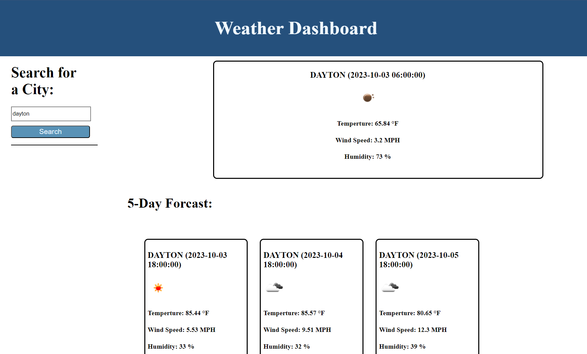

# 5-day-forcast-app

# My-Coding-Quizzes

## Description

Thia web application will be able to pull the data from the weather API, and list them out accordingly by dates. 

## Installation

N/A

## Usage 

User can search any of the US cities to view the current and upcoming forcast for up to 5 days at a time

## Credits

Jacob Carver

## Deployed Page

## License

Please refer to the github page